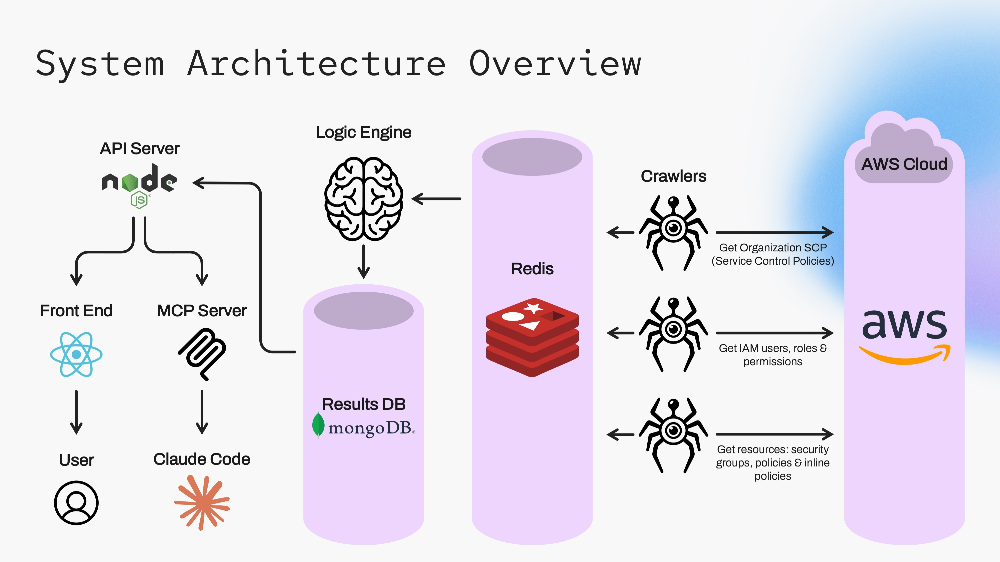

<p align="center">
  
</p>

# Demo 🔗

<p align="center">
  <a href="https://aura-cloud.shoham-fe.dev">
    
  </a>
</p>

<p align="center">
  <b>No signup. No AWS account. No setup.</b><br />
  Any email and password logs you straight into a fully populated dashboard.
</p>

---

# Aura Cloud — Real-Time Cloud Diagnostics for Developers

> [!NOTE]
> This README is synchronized with the live [Aura Cloud Project Document](https://docs.google.com/document/d/1RvmlKEA2fjbNBSnmLm0fzoDHxs1AiyM9yhTY1u_po2s/edit?usp=sharing).

Modern distributed development is fast, but cloud configuration is a minefield as it is usually a blind side for the non-devops RnD team members, AND modern AI tools like Cursor or Copilot. This persistent blind side makes it incredibly frustrating for developers to truly end-to-end debug their applications, creating a critical operational bottleneck.

Aura Cloud is a real-time diagnostic dashboard for developer environment health. It continuously maps your permissions for the cloud, organization-level policies, and resource configurations to flag security and operational anomalies related to the cloud, to quickly distinguish between local code bugs and cloud errors. By flagging the anomalies and providing a clear reasoning for them, it drastically reduces debugging time and accelerates DevOps resolution. As a result, engineering teams can maintain a high development velocity without constantly getting derailed by infrastructure friction, effectively securing the dev-to-prod pipeline against configuration drift.

---

## 👥 User Story: Early Detection and Resolution of Environment Drift

### The "Single Source of Truth" Strategy

The developer utilizes the Aura Cloud live audit dashboard as a definitive, single source of truth for overall infrastructure health. By maintaining continuous visibility into environment configurations, the engineering team can immediately pinpoint hidden cloud infrastructure failures, preventing developers from wasting hours debugging perfectly fine local code.

- **Morning Health Check (Starting the Day with Confidence):** The developer begins the workday by performing a quick 3-second sanity check on the dashboard. A clean, premium visual status displaying a 100% Health Score and 0 Active Blockers confirms that core environment components, organization-level policies, and permissions are perfectly up to date and functioning. This immediate green light ensures they are fully cleared to develop and deploy with complete confidence.
- **Encountering an Elusive Bug (The Unknown Failure):** In the afternoon, the developer deploys a new feature. Suddenly, a core functionality breaks—the application hits a persistent timeout and fails silently. At this stage, the developer has no idea that an SQS queue permissions issue is the culprit; they only know that something is fundamentally broken. They initially suspect their recent local code changes, a faulty Docker container setup, or a broken local configuration.
- **Instant Diagnosis (Exposing the Hidden SQS Problem):** Rather than losing hours down a rabbit hole of refactoring working code, adding print statements, and digging through chaotic application logs, the developer glances at the Aura Cloud dashboard to rule out the environment. Aura’s background crawlers have already caught the backend infrastructure anomaly in real-time. A red Blocked status card is flashing directly next to the transaction queue ARN, instantly pulling the hidden SQS problem out of the blind spot and exposing the exact root cause:
  ```
  Denied: No matching Allow statement found in identity policies for action sqs:SendMessage
  ```
- **Frictionless Collaboration & Targeted Escalation:** Armed with precise data, the developer bypasses the usual friction of opening a vague, unhelpful support ticket like _"Something is broken in staging, timeouts everywhere, please help."_ Instead, they initiate a highly targeted escalation by copying the exact diagnostic snippet and routing it directly to the DevOps administrator, pointing straight to the missing SQS IAM policies.
- **Rapid Resolution:** DevOps receives the exact context they need and applies a precise fix in seconds. Aura’s crawlers immediately pick up the update, refresh the cache, and the dashboard returns to a healthy green. The environment resumes working instantly, turning an invisible infrastructure blind spot that normally derails half a day into a frictionless, five-minute resolution.

---

## 🏗️ Component Architecture: Modular & Scalable

The platform was engineered from the ground up with system resilience and elastic scalability in mind. By decoupling the data collection crawlers, core logic evaluation pipeline, and API service, Aura ensures that a sudden surge in cloud infrastructure metadata never compromises the platform's analytical throughput, or that an internal error in the complex evaluation logic won’t create a noticeable downtime. This decoupled microservices architecture also allows individual components to scale or upgrade independently—resulting in a highly resilient system that matches the velocity of large-scale engineering teams.

<p align="center">
  
</p>

### 🔹 Crawlers

The crawlers are the workers behind the data collection engine. They continuously read live state data directly from the environment and pull everything from organization-level Service Control Policies (SCPs) down to fine-grained resource security groups and inline IAM attachments. The crawlers write to Redis for fast read/write operations.

- **Scale & Isolation:** Each cloud service (S3, SQS, IAM, etc.) is monitored by an autonomous crawler task. These tasks are fully isolated and decoupled, allowing them to scale horizontally and to run at different frequencies depending on the service rate limit.
- **Adaptive Rate-Limit Protection:** To protect production workloads, the crawlers use smart throttling algorithms. They automatically catch API rate limits (`ThrottlingException`), back off using an exponential jitter, and resume safely when the API clears to prevent account lockouts.

### 🔹 Logic Server

"The Brain" runs the core analytical loops of the platform. It continuously reads target user watchlists from MongoDB, pulls the latest cached active policies from Redis, executes the evaluation loops, and writes the finalized health states back to MongoDB.

- **Isolated & Resilient Process:** As the primary computational "heavy lifter" of the platform, this server is entirely decoupled from the ingestion and API layers. This isolation guarantees exceptional fault tolerance and elastic scalability, allowing the engine to scale horizontally or vertically to absorb performance jitter and sudden processing spikes without affecting the rest of the application.
- **Deterministic Configuration Reducer (Boolean Policy Solver):** Rather than evaluating permissions on the fly via complex, multi-layered cloud API calls, the engine maps fragmented raw data into a deterministic boolean equation. It checks context keys, handles dynamic environment variables, region restrictions, and multi-tier rule structures to resolve access states.

---

## 💾 Data Storage Tier (Hybrid Persistence Strategy)

Aura Cloud utilizes a dual-storage architecture, intentionally matching specific database engines to distinct technical tasks. By isolating high-frequency, in-memory operations from long-term relational document states, the system maintains low performance latency while ensuring data durability.

### 📈 Why Redis

- **Sub-Millisecond Graph Traversal:** Cloud permissions represent complex, hierarchical relationships (e.g., _User -> Group -> Permission Set -> Policy_). Querying these structures on the fly using standard database joins can create performance bottlenecks.
- **High-Throughput Caching:** Redis handles the fast-moving, high-frequency read/write operations. By using Redis Hashes and Sets, the background crawlers can dump deep JSON cloud configuration states extremely fast, allowing the Logic Engine to instantly fetch rules and solve permission equations.

### 🍃 Why MongoDB

- **Flexible Document Schemas:** Cloud configuration outputs, identity metadata, and policy condition blocks vary wildly between different cloud resources. MongoDB’s schema-less BSON structure perfectly accommodates this highly polymorphic data without requiring complex database migrations.

---

## 🔌 API Server (The Integration Layer)

Built on Node.js and Express.js, the API server unifies the entire platform, bridging backend background computing and frontend presentation. By serving as the primary gateway, it handles incoming queries from the frontend, interfaces with the storage tiers, and translates complex background evaluation cycles into clean, structured data payloads for real-time diagnostics.

### Main Features

- **60-Seconds Organization Onboarding:** Onboarding is completely automated via a dedicated CloudFormation template, treating infrastructure-as-code as the primary gateway into the platform. When initiated, the template programmatically deploys a highly restricted, read-only configuration tailored to Aura’s exact scanning specifications. This automation standardizes the setup pipeline across varying client scales, establishing a metadata-only access bridge back to Aura’s distributed crawlers without requiring manual cloud configuration.
- **Identity-Aware Resource Scoping (JWT Session Management):** Security and data isolation are enforced at the API gateway through industry-standard JSON Web Token (JWT) verification. This guarantees that multi-tenant data lines are strictly maintained, ensuring developers are dynamically served only the real-time infrastructure metrics and environment states relevant to their specific clearance and scope.

---

## 🎨 Frontend (Premium Developer UX)

- **Modern SPA Stack:** Built on React, Vite, and Material UI (MUI). Using React Query for server-state sync, the UI updates live in the background. Status cards change states seamlessly without full-page refreshes.

<p align="center">
  
</p>
